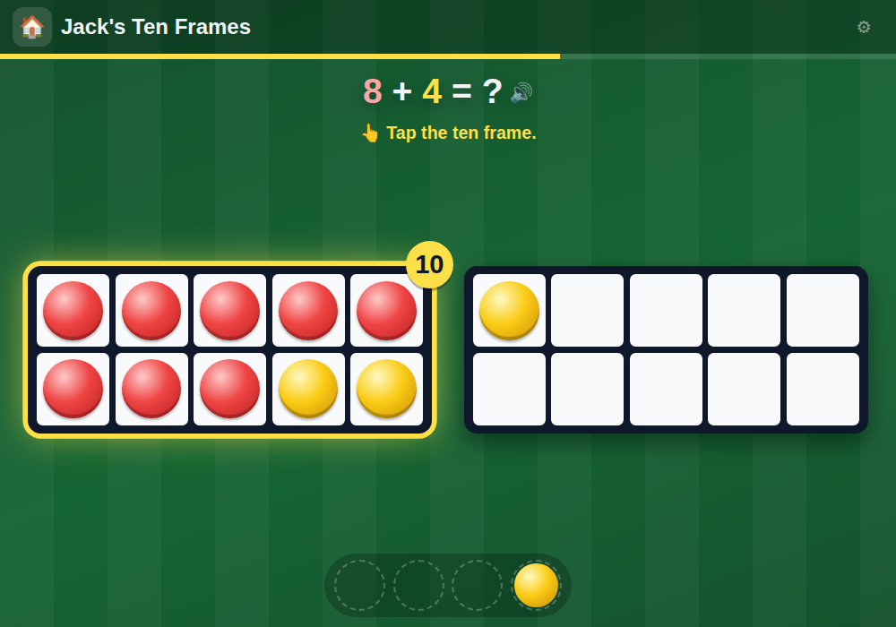

# 🔟 Jack's Ten Frames

**Adding with ten frames, the way Year 1 does it at school — see five-and-two, make ten, then go past it**

[](https://jacks-games.github.io/ten-frames/)




## What this is

A ten frame is two rows of five. Year 1 uses it so children stop counting one by one: seven
is *five and two more*, and the empty spaces show at once how many are missing to ten. The
counters are red and yellow, like the double-sided ones in class. Forty sums in five steps,
always in this order:

|   | Step | What happens |
|---|---|---|
| 1️⃣ | **Quick look** | The frame shows for three seconds, then it is covered — how many? |
| 2️⃣ | **Fill it up** | How many more to make ten? |
| 3️⃣ | **Add them up** | 4 + 2: tap the yellow counters into the frame one by one |
| 4️⃣ | **Make ten first** | 9 + 5: fill the first frame, the rest spill into the second |
| 5️⃣ | **Swap to make ten** | Two frames: tap yellow counters across until the first one is a full ten |

A full frame glows and wears a **10**.

## 🎮 How to play

### 1️⃣ &nbsp; Look, don't count 👀
In the first step the frame is covered after a quick look, so counting one by one does not
work — seeing *a full row and two more* does. **👀 Look again** opens it for another two
seconds.

### 2️⃣ &nbsp; Bring the yellow ones in 🟡
From step three on he builds the sum himself: every tap brings the next yellow counter in
from the tray and says its number. Then the question comes up: *"How many altogether?"*

### 3️⃣ &nbsp; Pick the number 🔢
Three tiles, one right. The wrong ones are the mistakes children really make: **one out**,
**the empty spaces read instead of the counters**, **the number just counted instead of the
total**, and **the full ten forgotten**. A wrong tap wobbles the tile, greys it out and points
at the part of the frame to look at — the second hint says a bit more. There is no way to lose.

### ⚽ &nbsp; Goal!
A right answer pays a football, shows the sum in rainbow letters and reads the frame back the
way a teacher would: *"Nine and one make ten. Ten and four make fourteen."* The praise changes
every time, and five right in a row is **On fire! 🔥**

### 🏁 &nbsp; Full time
After the fortieth sum the whistle goes. Progress is kept on the device; ⚙ jumps straight to
any of the five steps.

## 🎯 What it practises

- 👀 &nbsp; **Subitising** — seeing a number in fives instead of counting it
- 🔟 &nbsp; **Number bonds to ten** — what is missing to a full frame
- ➕ &nbsp; **Adding to 20 by making ten first** — 8 + 5 is 8 + 2 + 3
- 👂 &nbsp; **The words** — every question, hint and answer is spoken

## 🗣 The voice

Every line is a **pre-rendered clip** of Microsoft's neural `en-GB-SoniaNeural` voice — 151 of
them: each question, hint and answer, the praise, and the numbers one to twenty for counting
the yellow ones in. The browser's own speech synthesis is only the fallback for a line with no
clip.

Everything the game can say is built in one block of `index.html` marked `TEXT-CORE`, and the
phrase list the clips are rendered from is generated straight out of that block — so a new sum
can never end up with no voice.

## 🎈 The other games

| Game | What it is | |
|---|---|---|
| 🔟 [**Jack's Ten Frames**](https://github.com/jacks-games/ten-frames) | See numbers in fives, make ten, then add past ten on ten frames | [▶ play](https://jacks-games.github.io/ten-frames/)  👈 **this one** |
| ⏰ [**Jack's Clock**](https://github.com/jacks-games/clock) | Read the clock and set the hands — o'clock, half past, quarter past, quarter to | [▶ play](https://jacks-games.github.io/clock/) |
| 💯 [**Jack's Big Numbers**](https://github.com/jacks-games/big-numbers) | Tens and ones, adding and taking away all the way to 100 | [▶ play](https://jacks-games.github.io/big-numbers/) |
| 👀 [**Jack's Sight Words**](https://github.com/jacks-games/sight-words) | The twenty most common English words on big cards — tap one and hear it read out | [▶ play](https://jacks-games.github.io/sight-words/) |
| 🍎 [**Jack's Apples**](https://github.com/jacks-games/apples) | Trace 1–20, then fill the missing numbers into the apple grid | [▶ play](https://jacks-games.github.io/apples/) |
| 📖 [**Jack's Words**](https://github.com/jacks-games/words) | Hear a word, build it from letter tiles, then read it in a sentence | [▶ play](https://jacks-games.github.io/words/) |
| 🥅 [**Jack's Match**](https://github.com/jacks-games/match) | Tell real words from decodable nonsense words, then spell by ear | [▶ play](https://jacks-games.github.io/match/) |
| ✏️ [**Jack's Letters**](https://github.com/jacks-games/letters) | Finger-trace all 26 lowercase letters in the correct stroke order | [▶ play](https://jacks-games.github.io/letters/) |
| 🔢 [**Jack's Numbers**](https://github.com/jacks-games/numbers) | Count, add and subtract with footballs — to 10, then to 20 | [▶ play](https://jacks-games.github.io/numbers/) |
| ♟️ [**Jackies Schach**](https://github.com/jacks-games/chess) | Full FIDE rules with a coach that marks the safe squares (German) | [▶ play](https://jacks-games.github.io/chess/) |

All ten on one start page: **[jackbenn.ing](https://jackbenn.ing)** — newest first, homework on top, chess always last.

## 🛠 Built like this

Every game in this organisation is **one self-contained `index.html`** — no build step, no
framework, no package manager, no analytics, and no network calls once the page has loaded.
That is a deliberate constraint: a game a child depends on should still work in five years,
and a parent should be able to read the whole thing in one sitting.

- **Speech** — pre-rendered clips played through Web Audio, with the Web Speech API as the
  fallback. The `AudioContext` is created inside the ▶ tap, because iOS refuses to start
  audio any other way.
- **Progress** — kept in `localStorage` on the device (`jackFramesIndex`, `jackFramesFootballs`).
  Nothing is collected, sent or stored anywhere else.
- **Made for** an iPad mini in either orientation and a phone: the frames grow and shrink to
  the space they have, so the tray and the tiles are never pushed out of reach. Finger-sized
  targets, no hover-only interactions, `prefers-reduced-motion` respected.

Run it locally:

```bash
python3 -m http.server 8000
```

The start page at [jackbenn.ing](https://jackbenn.ing) is built from
[google814/Jack](https://github.com/google814/Jack), which is the source of truth. The repos
in this organisation are copies kept in step by `tools/sync-game-repos.sh` in that repo, so
each game also has its own page and its own link.
